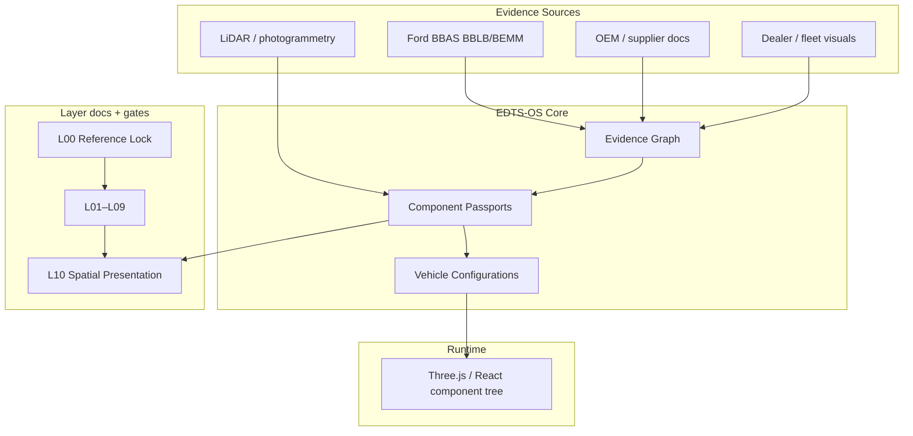

# ARCHITECTURE.md

High-level architecture of the Elektron digital twin foundation.

**Active framing:** [EDTS_OS.md](EDTS_OS.md) v3 — **Component First**. Vehicles are ephemeral configurations over a graph of passports + Evidence Graph edges.

## System context



## Layer dependency chain

Each layer depends on all previous layers being gate-complete:

```
L00 → L01 → L02 → L03 → L04 → L05 → L06 → L07 → L08 → L09 → L10
```

| Layer | Primary artifact type |
|-------|---------------------|
| L00 | Reference specification (no mesh) |
| L01 | Exterior shell mesh / materials |
| L02 | Frame, suspension, underbody |
| L03 | OEM engine, transmission, fuel, exhaust |
| L04 | Disassembly graph and sequences |
| L05 | Battery envelope and mounts |
| L06 | Motor, inverter, charger assemblies |
| L07 | HV harness and cooling loops |
| L08 | Workflow states and evidence links |
| L09 | Diagnostic attachment points |
| L10 | Composed scene, LOD, presentation |

## Repository layout

```
elektron-digital-twin-foundation/
├── EDTS_OS.md           # v3 OS constitution (Hard Rule 0)
├── EDTS_RESEARCH_PROTOCOL.md
├── STATUS.json          # machine state
├── components/          # Component Passports (Hard Rule 0)
├── configurations/      # ephemeral vehicle assembly pointers
├── layers/              # per-layer specs + Evidence Graph
├── research/            # log, questions, assumptions
├── schemas/             # JSON schemas (evidence-graph, passport, claims)
├── templates/           # entry templates
└── assets/              # derived geometry (gitignored OEM CAD)
```

## Integration with Build Engine

| Build Engine artifact | Digital twin use |
|-----------------------|------------------|
| `docs/research/RESEARCH_MAP.md` L1 (Ford OEM) | L00 geometry source paths |
| `docs/specifications/rev07/10_MEASUREMENT_AND_SCANNING.md` | L00 scanning strategy alignment |
| OpenDataRequirements | Feed into `research/OPEN_QUESTIONS.md` |
| Supplier candidates | L06–L07 component placeholders |

The digital twin foundation does **not** replace Build Engine doctrine. It consumes locked decisions and dimensions once available.

## Gate architecture

Gates are **documentation and review checkpoints**, not automated CI (until M10+ tooling exists).

```
Layer work complete
       ↓
Self-check vs QUALITY_STANDARD
       ↓
Record in layer doc + STATUS.json
       ↓
Owner approval where required (L00, major changes)
       ↓
Advance active_layer
```

## Technology choices (deferred to L10)

- 3D format: glTF 2.0 preferred (see THREE_D_SPEC.md)
- Viewer: TBD — Three.js, Babylon.js, or Unreal pixel streaming evaluated at L10
- Unit system: millimeters internal, inches displayed where OEM sources use inches

## Security and licensing

- OEM CAD in private storage only
- `assets/` contains derived work with provenance manifest
- No customer PII in twin repository
