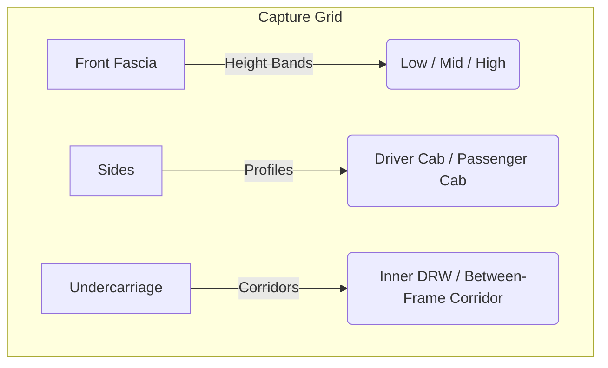

# EDTS Layer 1 Required Photo Shot List

**Status:** `DRAFT — NOT AUTHORIZED FOR EXECUTION UNTIL SOURCE BASELINE PATH CLEARS`  
**Optics:** Standard non-distorting lenses (equivalent to ~50 mm full-frame); low ISO; avoid wide-angle fisheye that compromises geometric visual checks.  
**Complements:** `L1_CAPTURE_COVERAGE_GRID_PROPOSAL.json`, `L1_REFERENCE_VIEW_MATRIX.md`

---

## Exterior Body Surfaces

- [ ] **SH-EXT-01** (Front Fascia - Low Band): Ground-level straight-on looking at front bumper underside, valence lip, and tow-hook penetrations.
- [ ] **SH-EXT-02** (Front Fascia - Mid Band): Headlight center-line straight-on capturing grille-mesh-to-hood gap transitions.
- [ ] **SH-EXT-03** (Front Fascia - High Band): Hood plane look-down angle from 2-meter step stool, highlighting windshield cowl gaps and wiper mounts.
- [ ] **SH-EXT-04** (Driver Cab Profile - Mid Band): Straight-on orthographic silhouette centered on B-pillar.
- [ ] **SH-EXT-05** (Passenger Cab Profile - Mid Band): Match height/distance of SH-EXT-04 for right-side visual asymmetry check.
- [ ] **SH-EXT-06** (Rear Cab Wall): Back view down the frame rail, showing glass profile, roof perimeter lip, and cab-vent apertures.
- [ ] **SH-EXT-07** (Wide-Track Fender Arch Flares): Detail close-ups of the interface between the wide-track fender flare lip and the metal fender skin.

## Chassis and Frame

- [ ] **SH-CHM-01** (Left Frame Channel - Outer): Orthogonal profile view from behind driver-side front wheel well to rear cab wall.
- [ ] **SH-CHM-02** (Right Frame Channel - Outer): Orthogonal profile view of passenger rail.
- [ ] **SH-CHM-03** (Left Frame Channel - Inner): Capture inner web face from under-cab corridor pointing outboard.
- [ ] **SH-CHM-04** (Between-Frame Corridor - Front to Rear): View looking aft from behind transmission crossmember down center tunnel.
- [ ] **SH-CHM-05** (Rear Frame End Cut): Profile of raw frame-end flange looking directly down the longitudinal axis.

## Suspension and Running Gear

- [ ] **SH-SUS-01** (Front Axle Beam - Front Face): Wide face capture of front axle assembly from bumper baseline (do not assume monobeam until `CNF-001` closed).
- [ ] **SH-SUS-02** (Front Axle Beam - Rear Face): Look forward from steering gearbox showing linkage connections.
- [ ] **SH-SUS-03** (Inner DRW Interface): View of inner dual wheel face, hub mating flange, and brake rotor clearance gaps.
- [ ] **SH-SUS-04** (Outer DRW Interface): Close-up of outer wheel dish profile, including stud pattern and the visual pose ornament (`VISUAL_POSE_LANDMARK` only).
- [ ] **SH-SUS-05** (Wheel Wells - Front/Rear): Ceiling-down view of inner fender liners and splash shield fasteners.

## Capture Metadata (required per shot)

For each completed shot, record: shot ID, ISO, focal length (35 mm equiv), camera height (m), working distance (m), azimuth (rad or deg), timestamp, VIN of subject vehicle, and storage path under `research/reference_images/controlled/`.
